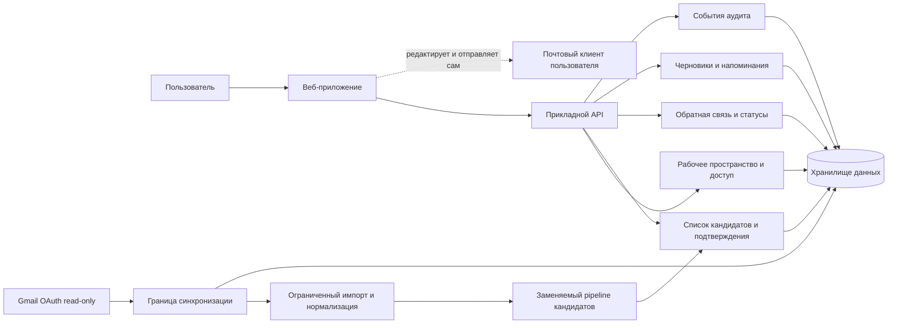

# «Дожим»: предварительное архитектурное предложение

**Статус:** концепция для обсуждения; подчиняется результатам проверки из [PRD.md](PRD.md) и не разрешает начинать разработку интеграции.

## Назначение и границы

Этот документ описывает границы ручного concierge-пилота и возможное логическое устройство продукта **только после прохождения валидационного gate**. Это не выбранный стек, техническое задание на инфраструктуру или подтверждение спроса, точности обнаружения, масштабов, соответствия нормативам либо причинного влияния на выручку.

Текущий этап — четырёхнедельный ручной тест на ограниченных выборках отправленных писем. Участник заранее выбирает контрольный набор; основатель по зафиксированным сигналам формирует отдельный слепой набор кандидатов до знакомства с метками участника. Участник решает, требует ли кандидат действия сейчас, отмечает итог/причину и сам отправляет follow-up. При желании может быть необязательное сравнение с обычной практикой по некоторым не срочным кандидатам; это ручной исследовательский приём, не системная функция и не основание причинной атрибуции. Интеграции с Gmail и работающего приложения сейчас нет и до положительного решения по PRD не требуется.

Набор участников может сравнивать под-сегменты агентств и операционные характеристики; ни отрасль, объём, использование CRM, размер контракта, ни конкретный плательщик не являются установленным ICP. Диапазон 5–30 предложений в месяц через Gmail — гипотеза выборки, не архитектурное или рыночное требование. Предложение не должно закреплять конкретную ICP, модель оплаты или причинную атрибуцию.

## Граница системы: concierge-пилот

**Участники и роли**

- **Участник** (набор пока ориентирован на владельцев агентств, но сегмент — гипотеза) выбирает и передаёт небольшой набор с минимальными данными, классифицирует предложения и кандидатов, самостоятельно отправляет письма и сообщает еженедельные наблюдения.
- **Основатель/оператор** до получения контрольных меток фиксирует правила и слепой список, вручную разбирает выборку, возвращает список кандидатов и ведёт раздельный учёт контрольного и слепого наборов, пропусков и исходов.
- **Почтовый провайдер** остаётся у участника. Приложение не получает к нему доступ.

**Движение данных:** участник вручную выбирает экспорт/фрагменты или указывает отправленные предложения и соседние письма; по возможности обезличивает и передаёт ограниченную выборку согласованным способом. Основатель независимо фиксирует слепых кандидатов до раскрытия контроля, возвращает участнику датированный список с причиной пометки и предлагаемым следующим шагом, затем получает метки и недельные отчёты. Для каждого кандидата участник выбирает состояние действия: **актуально — написать сейчас; актуально позже** (с датой); **намеренно не связываться; потеряно/отказ; ошибка обнаружения; не уверен**. Для неактуальных сейчас фиксируется причина. Это метки исследования, не обязательная схема будущего продукта. Полный почтовый ящик не собирается; пароль не запрашивается; данные не передаются модели или иному внешнему обработчику. Срок удаления согласуется до начала пилота.

**Чего нет:** веб-приложения, аккаунтов/tenant-хранилища, автоматического чтения почты, синхронизации, классификатора, фоновых задач, отправки или автоматических напоминаний. Ручные таблицы/файлы, если используются оператором, — временный инструмент исследования, не производственная система.

## Возможная архитектура после успешной проверки

Это логические компоненты, а не обязательные отдельные сервисы. На начальном этапе их допустимо разместить в одном приложении; конкретный стек и инфраструктура не выбраны.

**Поток:** пользователь явно подключает аккаунт только после оценки разрешений и согласия; граница синхронизации получает ограниченный доступ, преобразует нужные данные в минимальный внутренний формат и передаёт их заменяемому pipeline обнаружения. Кандидаты появляются в пользовательском списке с объяснимыми причинами и остаются неподтверждёнными до проверки человеком. Подтверждения и исправления возвращаются как данные качества, не как автоматическая «истина». Напоминание или черновик могут быть предложены пользователю; отправка происходит вне системы в его почтовом клиенте.

### Логические обязанности

- **Веб-приложение/API:** аутентификация пользователя, рабочее пространство (tenant), проверка доступа на каждом запросе, согласие и настройки, просмотр и ручная разметка.
- **Граница Gmail и синхронизации:** отдельно управляет выдачей/отзывом токена, ограничивает типы и период чтения, ведёт курсор синхронизации и переводит ответы провайдера во внутренний формат. Детали Gmail не должны проникать в логику обнаружения или интерфейс.
- **Импорт/нормализация:** принимает минимальные метаданные и только необходимый контекст; отделяет источник данных от признаков обнаружения. Полные тела и вложения не являются стандартным долговременным хранилищем.
- **Pipeline кандидатов:** отдельные этапы сигналов, отбора, объяснения и дедупликации. Начать с простых заменяемых правил; классификатор — только если проверка покажет необходимость и приемлемость. Версия правил/модели сохраняется на кандидате для воспроизводимого разбора.
- **Список, feedback, черновики:** показывает источник, дату и причину; пользователь отмечает «релевантен / нерелевантен / не уверен», исправляет статус и решает, отправлять ли сообщение. Напоминание и черновик — подсказка, не действие от имени пользователя.
- **Хранилище, audit и удаление:** хранит данные по tenant, статусы и минимальные связи с исходной перепиской; регистрирует значимые действия и состояние синхронизации; поддерживает отзыв доступа и контролируемое удаление.

## Основные сущности

Поля ниже — предполагаемый минимум для обсуждения. Схема не утверждает конкретный тип базы данных или окончательные сроки хранения.

| Сущность | Минимальные поля и связи |
|---|---|
| Рабочее пространство | `workspace_id`, имя/настройки, даты создания и удаления; владеет участниками, подключением и кандидатами. |
| Пользователь и членство | `user_id`, способ аутентификации, `workspace_id`, роль и статус; доступ ограничен рабочим пространством. |
| Согласие/подключение | `workspace_id`, провайдер, разрешённые области доступа, время предоставления/отзыва, состояние; токен хранится отдельно и шифрованно, никогда не в логах. |
| Источник переписки | `workspace_id`, провайдер, внешний ID треда/письма, дата, минимальные метаданные, время синхронизации; тело/вложение — только если доказана необходимость, с отдельным правилом удаления. |
| Кандидат | `candidate_id`, `workspace_id`, ID источника, версия pipeline, признаки/объяснение, дата последнего исходящего, состояние обнаружения и уверенность при наличии; сумма сделки только если введена/подтверждена участником. |
| Проверка и обратная связь | `candidate_id`, пользователь, метка предложения, релевантность и действие (`написать сейчас`, `позже` + дата, `не связываться`, `потеряно/отказ`, `ошибка обнаружения`, `не уверен`), причина; факт и дата отправленного follow-up, доставка/bounce при известности; ответ/встреча/статус/неизвестно. Связь исхода с follow-up — только как сообщил пользователь; неизвестное и пропуски отдельны. |
| Черновик/напоминание | `candidate_id`, текст или ссылка на шаблон, автор/версия, плановое время и состояние; не содержит команду или токен отправки. |
| Audit-событие | `workspace_id`, актор/система, действие, объект, время, результат; без полного тела писем и секретов. |

Идентификаторы и связи внешнего провайдера нужны для идемпотентной синхронизации и открытия исходного письма, но их состав и хранение зависят от выбранных разрешений и проверки удаления.

## Жизненный цикл обнаружения и надёжность

1. Подключение не синхронизируется до явного согласия; отзыв запрещает новые чтения и запускает предусмотренную политику удаления.
2. Синхронизация запрашивает только разрешённый диапазон/изменения, сохраняет контрольную точку после успешной обработки и не считает устаревший список актуальным при ошибке.
3. Нормализованные признаки передаются версионированным pipeline. Кандидат остаётся гипотезой и содержит объяснимые признаки; отсутствие ответа не означает забытую или живую сделку. Только пользовательская проверка присваивает действие/исход, включая «написать сейчас», «позже» и «ошибка обнаружения».
4. Уникальность источника в пределах workspace (workspace + provider + внешний ID письма/треда) и повторяемая версия обработки предотвращают дубли при повторном запросе. Повторная синхронизация обновляет состояние кандидата, а не создаёт новый экземпляр без причины.
5. Временные сетевые/провайдерские ошибки допускают ограниченный повтор с задержкой и безопасным ключом идемпотентности; постоянная ошибка, истёкшее согласие или недостаточные права показываются пользователю и требуют его действия. Повтор не должен отправлять почту или дублировать напоминания.
6. Поздний ответ переводит кандидата в состояние «ответ обнаружен» с источником и временем; это не переопределяет пользовательское решение о релевантности без проверки. Неоднозначность направляется на ручную проверку. Исправление пользователя сохраняется с актором и временем, чтобы повторная обработка не стирала его молча.
7. Удаление workspace/отключение интеграции блокирует дальнейшую синхронизацию и очищает доступные данные по согласованному графику, включая производные признаки и связи. Гарантии удаления из резервных копий и их сроки должны быть определены до пилотирования интеграции.

## Доверие и безопасность

- **До Gmail — решение gate, не предпосылка.** Сначала проверить в concierge-пилоте потребность и доверие к ограниченной передаче данных. Перед интеграцией отдельно изучить актуальные OAuth scopes/правила провайдера и подтвердить, что доступ действительно read-only и минимален; ничего не считать предварительно одобренным.
- **Согласие и минимизация:** объяснить пользователю, какие папки/период/поля читаются и зачем; разрешить отключение и отзыв. Ограничивать данные метаданными и необходимым коротким фрагментом. Не хранить полные тела и вложения по умолчанию.
- **Секреты:** OAuth-токены/учётные данные шифруются при хранении и передаче, выдаются только компоненту синхронизации, не журналируются; конкретное управление ключами — открытый выбор.
- **Изоляция:** каждое чтение/изменение проверяет tenant/workspace; фоновые задачи и ключи кэша также включают workspace. Проверки изоляции обязательны до доступа к нескольким клиентам.
- **Аудит:** фиксировать подключение/отзыв, синхронизацию, просмотр/изменение кандидата и удаление, минимизируя чувствительные данные в журнале.
- **Обработка моделей:** содержимое почты не передаётся LLM или иному внешнему провайдеру без отдельного решения, согласия, оценки условий хранения и документированной необходимости. Архитектура не должна требовать LLM.
- **Retention:** определить конкретные сроки для метаданных, токенов, журналов, пользовательского экспорта и резервных копий до пилота продукта; предоставить экспорт/удаление и показать пользователю статус. Никаких неподтверждённых заявлений о сертификации или соответствии требованиям.

## Неопределённые решения и gates

| Решение | Когда принимать и что проверить |
|---|---|
| Стек, монолит/разделение компонентов, база и очередь задач | После валидационного gate; выбрать простейший вариант, покрывающий выбранный сценарий, поддержку tenant-изоляции, отзыв и удаление. Сейчас не фиксировать framework, облако, базу или брокер. |
| Gmail scopes и доступ | До интеграционного прототипа изучить актуальные требования провайдера, минимальные read-only разрешения, consent screen, процедуру отзыва и ограничения хранения; если минимальный доступ недоступен или доверие не подтверждено — не интегрировать. |
| Обнаружение | После ручного сравнения контрольного и слепого наборов выбрать, проверять ли метки пользователя, простые правила или классификатор. Определение предложения не менять посреди когорты. |
| Размещение и регион | До хранения реальных пользовательских данных проверить требования пользователей, провайдера и применимые обязательства; регион пока не назначать. |
| LLM или без модели | Начинать без обязательной модели. Решение о черновиках/классификации принимать только после оценки качества, приватности, стоимости и согласия на передачу. |
| Точный состав писем и retention | До первого реального подключения решить, какие поля/фрагменты необходимы, срок каждого типа данных, срок резервных копий и подтверждение удаления. Не собирать полный ящик. |
| Напоминания и порог тишины | Только после интервью/пилота выяснить подходящий срок, частоту и возможность отключения; не спамить и не выдавать молчание за упущенную сделку. |

## Поэтапная реализация, если данные поддержат её

1. **Сейчас — concierge:** ограниченные выборки, версия рубрики, раздельные контрольный и слепой наборы, ручной список, метки и недельные check-in. Никакой интеграции или кода продукта.
2. **Gate после 4-недельного пилота:** перейти к прототипированию только если PRD-критерии по оцениваемым участникам, precision ручного отбора, usefulness и повторному использованию выполнены; иначе уточнить проблему/сегмент или остановиться. Результаты описательны и не доказывают причинную выручку.
3. **Тонкий прототип без почтового OAuth:** загрузка ограниченной выборки или ручные метки → очередь кандидатов → объяснение → feedback. Проверить, можно ли воспроизвести полезную ручную работу и измерять ошибки безопасно.
4. **Gate на интеграцию:** только после отдельного подтверждения пользовательской ценности и приемлемости разрешений спроектировать один read-only коннектор, синхронизацию, отзыв и удаление; пройти проверку scopes, изоляции и жизненного цикла данных.
5. **Узкий MVP:** список подтверждаемых кандидатов и ручные статусы; напоминания/редактируемые черновики добавлять лишь по результатам тестов. Автономная отправка не входит в целевую границу.

## Основные риски и смягчение

| Сбой/риск | Архитектурная реакция |
|---|---|
| Правила выбирают нерелевантные письма или пропускают предложения | Версия правил, объяснение каждого сигнала, раздельная разметка «не уверен», feedback и отчёт ошибок; не обучать/менять классификатор без нового gate. |
| Дубли или устаревший статус при повторной синхронизации | Уникальный ключ источника, идемпотентное обновление, контрольная точка, видимое время последней успешной синхронизации. |
| Ответ клиента пропущен либо найден с задержкой | Отображать источник и время проверки; поддерживать ручное исправление; не объявлять отсутствие ответа фактом. |
| Отзыв доступа не прекращает обработку | Централизованное состояние подключения; синхронизация проверяет его перед чтением; отзыв останавливает задания и запускает удаление по политике. |
| Утечка данных между агентствами | Tenant-проверки на каждом API/задании, изолированные ключи, тесты межтенантных запросов и минимальные аудиторские записи. |
| Письмо/черновик отправлен неверному адресату автоматически | Отправки из системы нет; черновик требует проверки пользователем и открывает источник. |
| Пользователь не готов дать доступ или контент нужен модели | Не форсировать Gmail/LLM; оставить ручную загрузку/метки либо пересмотреть ценность и отказаться от интеграции. |
| Результаты выглядят успешнее из-за пропусков | Отдельные знаменатели participant/item, маркировка оцениваемых и неполных случаев; неизвестное и отсутствующие данные не считать отрицательным исходом. |

**Итоговая граница:** сначала ручная проверка ценности и воспроизводимости разметки; программная система и Gmail — условные последующие решения. Реализация этой архитектуры должна следовать подтверждённым ограничениям и фактам пилота, а не заменять их предположениями.
